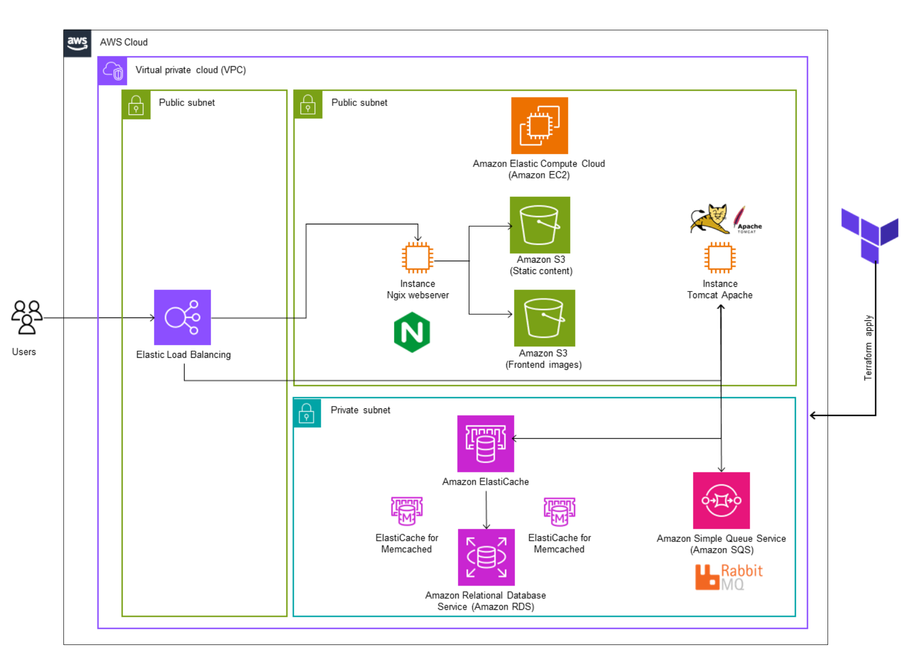
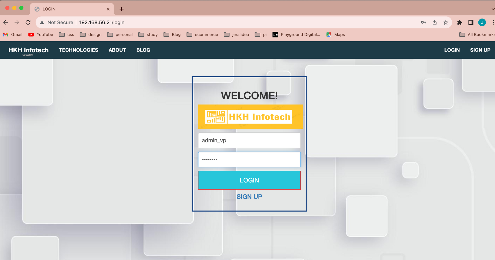
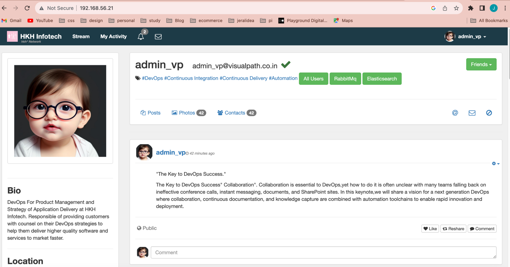
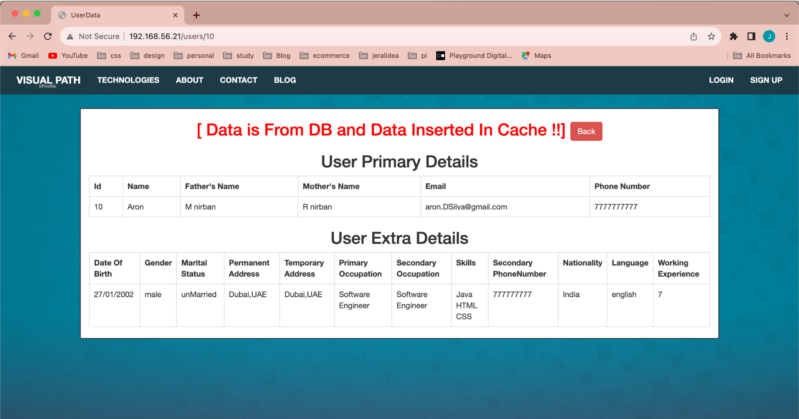
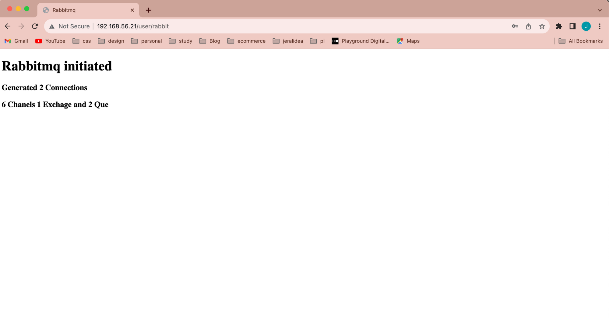

# Building my DevOps Portfolio

One of the benefits of working at EY is access to Udemy's educational resources. I've taken the initiative to enroll in the course "DevOps Projects | 20 Real-Time DevOps Projects" to continue learning and gain hands-on experience. I'm excited to share this journey for educational purposes.

## Project 1: Multi-Tier Web Application Setup Locally (Manual and Automated Provisioning)

**About:**
- Multi-tier web application stack.
- Setup on Laptop/Desktop.
- Baseline for upcoming projects.

**Scenario:**
- Working on a project with various services that power the project runtime.

**Problem:**
- Uncomfortable making changes in real servers.
- Complex local setup.
- Time-consuming.
- Lack of repeatability.

**Solution:**
- Local Setup.
- Automated, Repeatable, Code (Infrastructure as Code).
- Initial manual provisioning of the infrastructure.
- Subsequent automated provisioning of the infrastructure.

**Tools:**
- Hypervisor (VMware).
- Automation (Vagrant).
- Command Line Interface (Git Bash).
- Integrated Development Environment (Visual Studio Code).

**Objective:**
- VM Automation locally.
- Baseline for upcoming projects.
- Real-world project setup locally.

**Setup Order (as per Vagrant file):**
1. MySQL (Database SVC).
2. Memcache (DB Caching SVC).
3. RabbitMQ (Broker/Queue SVC).
4. Tomcat (Application SVC).
5. Nginx (Web SVC).

## Infrastructure Architecture Diagram (IAD)

In this section, you will find an updated version of the infrastructure architecture diagram representing the local stack (which is based on the IAD shared by the course instructor). Please note that this diagram serves as a preliminary visualization and lays the foundation for our future deployment in the AWS cloud environment. It is subject to revisions and refinements to accurately reflect the changing architecture and requirements as we progress. 

**GitHub Repository:** [DevOps Projects | 20 Real-Time DevOps Projects](https://github.com/jeraldinnemg/vprofile-project)

**Udemy Course:** [DevOps Projects | 20 Real-Time DevOps Projects](https://www.udemy.com/course/devopsprojects/)

## Automated Provisioning of the infrastructure evidence.

